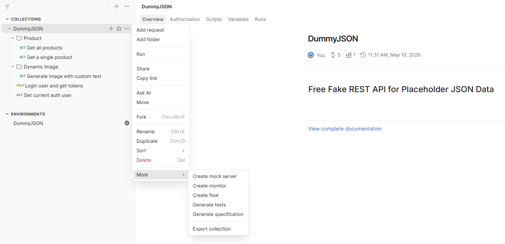
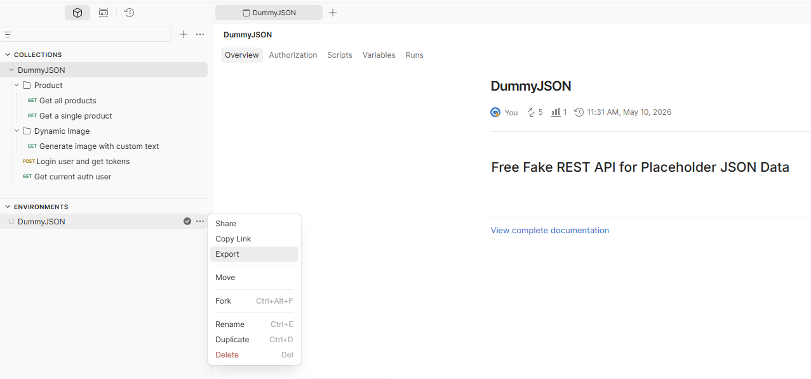

# JPostman

[](https://github.com/dgofman/JPostman/actions/workflows/maven.yml)


**JPostman** is a small Java helper library that lets you reuse exported **Postman collections** and **Postman environments** directly in Java tests.

Instead of copying request URLs, headers, authentication, query parameters, and JSON bodies from Postman into Java code, you keep Postman as the single source of truth. Export the collection and environment, load them in Java, optionally override values, and run the request with Rest Assured.

---

## Why JPostman?

When API tests are written manually, the same request details often exist in two places:

1. Postman collection
2. Java test code

That creates duplication and maintenance problems.

If a header, body, URL, token, query parameter, or auth configuration changes in Postman, you also need to remember to update Java tests. JPostman reduces that duplication by letting Java tests load the same exported Postman resources.

With JPostman:

- Keep request definitions in Postman.
- Export the Postman collection and environment.
- Load them from Java.
- Build requests using environment values.
- Override only what is different for the test.
- Execute with Rest Assured.

This is especially useful when Postman is already used by developers, QA, or API teams.

---

## Exporting From Postman

JPostman works with exported Postman collections and environments.

### Export Collection

In Postman, right-click your collection and export it:



### Export Environment

Export your environment the same way:



Place the exported files under project resources, for example:

```text
src/main/resources/DummyJSON.postman_collection.json
src/main/resources/DummyJSON.postman_environment.json
```

---

## Supported Request Parts

JPostman parses and applies common Postman request components:

- Collection folders
- Requests
- URLs
- Query parameters
- Headers
- Auth parameters
- Raw JSON body
- Environment variables
- Variable replacement such as `{{base_url}}`, `{{username}}`, and `{{accessToken}}`

---

## Basic Usage

Load a collection and environment:

```java
Collection col = Collection.load(
        TestRestAssured.class.getClassLoader()
                .getResourceAsStream("DummyJSON.postman_collection.json"));

Environment env = Environment.load(
        TestRestAssured.class.getClassLoader()
                .getResourceAsStream("DummyJSON.postman_environment.json"));
```

Get a request template from the collection:

```java
Request template = col.getRequest("Login user and get tokens");
```

Build a resolved request using the environment:

```java
Request req = template.builder().build(env);
```

Execute it with Rest Assured:

```java
Response response = req.apply(given())
        .post(req.getUrl())
        .then()
        .log().ifValidationFails()
        .statusCode(200)
        .body("accessToken", notNullValue())
        .extract()
        .response();
```

## Request Execution API

JPostman separates **request configuration** from **request execution**.

```java
req.apply(given())
```

Useful when additional Rest Assured customization is needed:

```java
req.apply(given())
    .auth().oauth2(token)
    .log().all()
    .when()
    .get(req.getUrl());
```

---

### Configure + Execute

```java
req.execute(given())
```

Automatically:
1. applies request configuration
2. executes the HTTP method defined in the Postman collection

Supported methods:
- GET
- POST
- PUT
- PATCH
- DELETE
- HEAD
- OPTIONS

Example:

```java
Response response = req.execute(given())
        .then()
        .statusCode(200)
        .extract()
        .response();
```
---

## Fluent Request Overrides

You can override values from Postman without rewriting the whole request.

### Update Query Parameters

```java
Request req = template.builder()
        .queries(q -> q.set("text", "Hello World"))
        .build(env);
```

Alternative nested style:

```java
Request req = template.builder()
        .queries()
            .set("text", "Hello World")
        .end()
        .build(env);
```

### Update Body Values

```java
Request req = template.builder()
        .body(b -> b.set("username", "emilys"))
        .build(env);
```

### Update Headers

```java
Request req = template.builder()
        .headers(h -> h.add("X-Test", "123"))
        .build(env);
```

### Update Auth Parameters

```java
Request req = template.builder()
        .auth(a -> a.set("token", "my-token"))
        .build(env);
```

---

## Summary

This makes Java API tests easier to maintain when Postman requests change.
